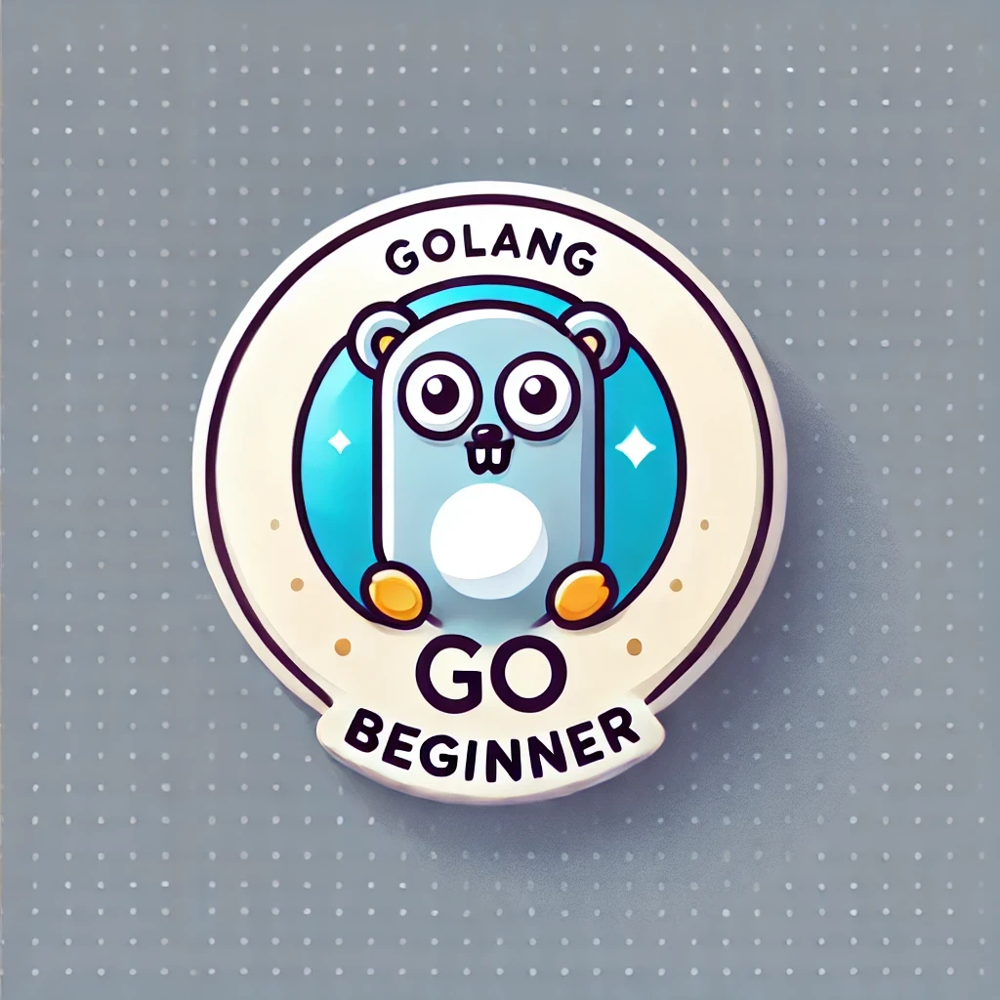

## Mission 1: Welcome to the Cyber Academy

### Introduction

Welcome, recruit! You’ve been selected to join the Cyber Academy, the frontline in the battle against cyber threats. Under the guidance of Agent Go and with the help of Byte the Cyber Dog, you will master the art of Go programming and become a formidable cyber detective.

### Mission 1.1: Setting Up Your Cyber Lab

**Objective:** Install Go, set up a code editor, and write your first Go program.

**Step 1: Install Go**

Before we dive into action, let's gear up! Download and install Go from the [official website](https://golang.org/dl/). Think of this as equipping yourself with the ultimate toolkit for your cyber missions.

**Step 2: Choose Your Weapon (Code Editor)**

What's your favorite code editor? Vote in the poll and see what other cyber detectives are using!

<div id="poll">
  <h3>What's your favorite code editor?</h3>
  <form id="poll-form">
    <label class="poll-option">
      <input type="radio" id="vscode" name="editor" value="VSCode">
      <span>VSCode</span>
    </label>
    <label class="poll-option">
      <input type="radio" id="sublime" name="editor" value="Sublime Text">
      <span>Sublime Text</span>
    </label>
    <label class="poll-option">
      <input type="radio" id="vim" name="editor" value="Vim">
      <span>Vim</span>
    </label>
    <label class="poll-option">
      <input type="radio" id="other" name="editor" value="Other">
      <span>Other</span>
    </label>
    <br>
    <input type="button" class="vote-button" value="Vote" onclick="submitPoll()">
  </form>
  <div id="poll-results" style="display:none;">
    <h4>Poll Results</h4>
    <ul>
      <li>VSCode: <span id="result-vscode">0</span> votes</li>
      <li>Sublime Text: <span id="result-sublime">0</span> votes</li>
      <li>Vim: <span id="result-vim">0</span> votes</li>
      <li>Other: <span id="result-other">0</span> votes</li>
    </ul>
  </div>
</div>

**Step 3: Write and Run Your First Go Program**

Time to test your new gear! Create a new file named `main.go` and type the following code. Watch the magic happen as you run your first Go program.

```go
package main

import "fmt"

func main() {
    fmt.Println("Hello, Cyber World!")
}
```

### Exercise:

*Change the message to something more exciting, like 'Hello, future Go hacker' and run it again.*

---------------------------------------------------------------------

**Interactive Coding:**

<div id="editor-container">
  <div id="editor">package main
import "fmt"

func main() {
fmt.Println("Hello, Hackers!")
}

</div>
  <div class="editor-buttons">
    <button id="run-code">Run Code</button>
    <button id="reset-code">Reset Code</button>
    <button id="copy-code">Copy Code</button>
  </div>
  <pre id="output"></pre>
</div>

### Achievements and Badges

Earn badges for completing modules and share them in your GitHub profile!



<button id="complete-module1">Complete Module 1</button>

<script src="https://cdnjs.cloudflare.com/ajax/libs/ace/1.4.12/ace.js" integrity="sha512-DtT9g5pN5+yoK++vQO9+pyflly3j58sUlB7K7OdFyRklzTkQ8UNZsm8QxQvsGeVG41fDkM9X2iHkFgtJ7Fk1ew==" crossorigin="anonymous"></script>
<script src="/assets/js/module1.js"></script>